# My Shopping List 
## Enterprise Database Development (SWD503)
*By Paris Hall, Solent University, January 15, 2021*

[Web Application](https://myshoppinglistph.azurewebsites.net/) 
[Git Repository](https://github.com/parxhall/MyShoppingList) 

# Table of Contents
1. [Introduction](#Introduction)
2. [Aim & Objectives](#Aim)
3. [Problem Statement](#Problem)
4. [Solution/System Overview](#Solution)
5. [Key Design Decisions](#Key) 
    - [Database Design](#Database) 
    - [Entity Relationship Diagram](#ERD) 
    - [Programming Architecture](#Prog) 
    - [Wireframes](#Wire)
6. [Security & Scalability](#Security)
7. [Conclusion](#Conclusion)
8. [Summary of Learning](#Summ)
9. [References](#References)
10. [Bibliography](#Bibliography)
11. [Table of Figures](#Figures)

## Introduction
I have been tasked with creating a proof-of-concept full-stack web application. Within this readme I have provided a problem statement and offered a satisfactory solution, as well as justifying my key design decisions.  

I have investigated different types of data schemas and chosen the one I believe best fit for my solution whilst rationalising my preference. By the end of this readme you will have a better understanding of how my website operates, the logic behind my design choices and the reasoning behind why my solution is secure and scalable. I hope that this level of detail will give you the right knowledge and understanding to grade my system.

## Aim:
The aim of this report is to give you a detailed overview of my solution and how it works, as well as specifying why I have chosen the implemented technologies. 

## Objectives:
-  I want to provide a solution that addresses my problem statement.
-  I want to provide a detailed overview of the interface with key screens so that you will understand how to use the solution.
-  I want to research different database designs and suggest why my chosen strategy is best for the solution.

## Problem Statement
I am having trouble tracking household items that are low in stock and later recalling said items when generating a shopping list. At present I notice an essential item like meat or poultry is almost gone and then quickly generate a list of items I believes I need, only to get home and discover I did not get everything. Given the current pandemic, trips to the shops should be reduced to one essential shop a week, therefore it is critical that I get all the items I need. Ideally anytime I need an item restocking I would mark it in an application and then automatically generate a list once a week when I can go shopping. 
In the future this app could be utilised by individuals shielding to generate a shopping list that can easily be used by their family members. 
The reason I have decided to create a shopping list application is because all the ones I had previous come past are very specific to one shop and usually result in you having to buy all the items online to utilise the list. I saw a gap in the market for a list that can be used across multiple shopping platforms, whether online or in-store as well as personalising the list to fit yours and other household needs. 

## Solution/System Overview
My solution is a web application that consists of 5 webpages: 
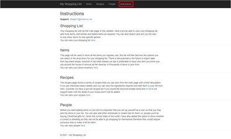 
I created a general information page which is a good place to start when using the application, this page gives a brief overview of the pages and how they are used, as well as giving contact information if support is required.  
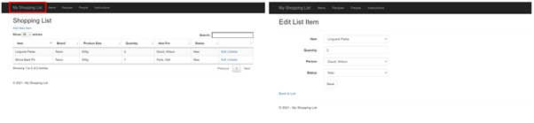 
The main page in the web application will be My Shopping List, for this reason I made the text slightly larger to emphasis its importance. On this page will be the list of items required in the household, this view will be used when going shopping. During your shopping trip you can delete items one at a time as you add them to your basket, in the future there will be an option to bulk delete all the list items after your trip. You can add new records uses the hyperlink on the page, as well as edit entries as required.  
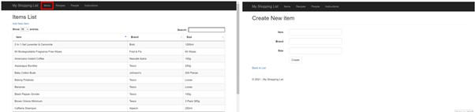 
Another important page to utilize and become familiar with is the Items page, this page will act as an inventory for all the items you currently buy on a regular basis. The first thing to do when entering the app is add all your common household items; I have populated the app with some dummy records for test purposes. Alternatively, you could email our support team to bulk import data.  
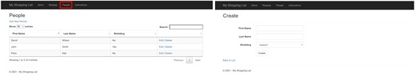 
I have created a People page, where you can add individuals which will later be assigned to items within your list, this means that you can filter the list based on who the items are for. This is a very important feature now more than ever given the pandemic and households self-isolating; this ability allows for you to easily do shops for shielding individuals.  
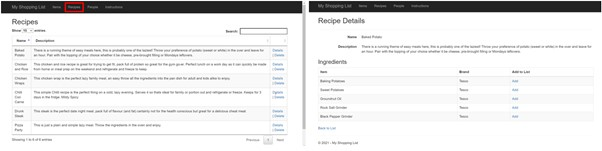 
I expanded on my solution by adding a page containing pre-set recipes that are connected to items, this allows you to directly add items to your list based on the ingredients within the recipe.  
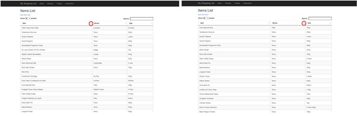 
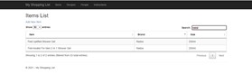 
You can also sort and search on any list view; using this ability you could search for an individual’s name and filter the list based on their items, then shop accordingly.
## Key Design Decisions 
### Database Design
I have decided to use a relational database in my solution because it provides lots of flexibility in terms of classification, security and accuracy of the data and tables alike. Relational databases allow easy adoption of normalisation to ensure the integrity of the database. Normalisation includes: no repeating elements or groups of elements (1NF), no partial dependencies on a concatenated key (2NF) and no dependencies on non-key attributes (3NF).  

There are limited disadvantages to using relational databases such as databases can “become complex as the amount of data grows” (GURU, 2020). As my solution is quite simple I didn’t see this as being a problem in the future. This combined with my prior knowledge of its techniques from my organisation have lead me to choose relational databases. 
### Entity Relationship Diagram
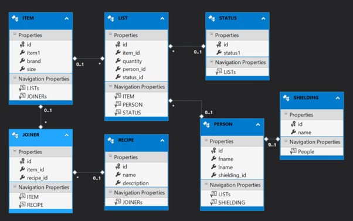 
I have created 6 tables in my database, 2 of which contain uneditable front-end data (Status and Shielding) used in dropdown list and set metadata against entries that can later be filtered against. I have created a join table, Joiner, to link Recipes and Items, this allows for a many-to-many relationship between the tables, this conforms with normalisation. The tables Item, List, Recipes and Person are the building blocks for the pages created in my website, with minor modifications to pull data from other tables. A good example of this is the table view created in the Recipe details page, pulling through all items used.
### Programming Architecture
I have chosen to use a Model View Controller MVC stack to construct my website; this separates the application “into three interconnected elements” (PAVIA, 2020). The benefit of choosing this pattern mean you can “scale the application in terms of complexity because it's easier to code, debug, and test something that has a single job” as the component are created separately (SMITH, 2020). 

One key benefit of this stack is that the Model does not rely on any other elements, whereas both the Controller and View depend on the Model, meaning you can make updates server side, within the database, without affecting the interface. You can view my solutions architecture from my GitHub: https://github.com/parxhall/MyShoppingList.
### Wireframes
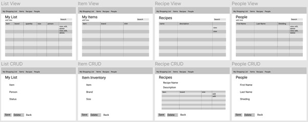 
I created my wireframe in Figma as it is a free to use software as well as allowing for prototype animation to visualise how to transition between pages. This can be viewed from this link: https://www.figma.com/file/eBCEzXBXKvleD8gwFoqXzl/MyShoppingList 
## Security and Scalability
The Model View Controller Stack used for the programming architecture allows for the application to be easily scalable as the 3 elements are kept separate. This allows for updates to be made to the Model and database with ease whilst still allowing the interface to run. Relational databases allow for data integrity and very specific security application on a table-to-table bases, this means I could declare particular tables more secure, for instance the person table. 

Because this project is a proof of concept the security has not been thought through as thoroughly as it could have, therefore there is room for improvement. Examples of ways I would increase security in my solution would be to add form verification, in which individuals would have to login before accessing. I did not see this fit in the first iteration of my solution as the data stored is not particularly personal, but there is mild personal data such as names and whether someone is shielding.

## Conclusion
I have met the requirements for the assignment as I have created and deployed a proof-of-concept full-stack web application that addresses my problem statement. My problem statement was to create a shopping list that I could use during my shopping trip which allows for list entries from shielding individuals. I achieved this by creating a list view with create, render, update and delete (CRUD) functionality and attached person data to each entry, this allowed me to implement sort and search functionality to filter the list based on who was shopping. I went beyond my problem statement and added a recipes page that displayed related ingredients in a table and allows you to add items to your shopping list from this view. 
I feel I did a good job of achieving the aim of giving a detailed overview of my solution and explaining my choice of technologies. I did this by presenting the page views in this document with an overview of how each page works. I kept my CRUD functionality consistent throughout each page to ensure the website was user friendly and to avoid confusion. I also researched in detail several different options for the key design stages including the options I had been given in my class and my work environment. The techniques I decided on related to my current industry practices.  
When styling my website I kept the theme simple, using only colour in the navigation bar and submit buttons. This is a modern technique that is well recognised on most webpages as it looks good as well as conforming to accessibility criteria, as the colours contrast well for someone with visual impairments.  
I had trouble when deploying my website to azure; I could access the website itself but any page which display information from the database would error (Figure 1). I turned off custom errors in my web.config file to gain some more information regarding the problem (Figure 2), this suggested there is a problem with azure trying to access the database. However after several failures I managed to deploy my database to Azure as well and this allowed me to access the tables. 

## Summary of Learning
With all this information I believe my assignment has met the requirements to pass the Marking Criteria. 
This term was delivered remotely, which I struggled with as my set up for coding is abysmal, having only one screen therefore creating and testing code was tricky and time consuming. I also struggle to engage with virtual lesson as it is hard to learn practical work from a single laptop screen whilst simultaneously trying to view zoom and code. As a result, I feel my assignment would’ve benefited from access to university facilities had the circumstances been normal. 
I attempted to follow the techniques specified in lesson but had several issues with coding and didn’t feel I could accomplish the assignment using them on my own.  Consequently I researched into other ways of creating web applications including advantages and disadvantages and settled on using a Microsoft SQL database, ASP.NET MVC stack architecture and Azure to deploy. One issue with using a cloud server such as Azure is cold starts, meaning the website can take a while to run on the first load. 
Nevertheless, I am proud of my achievements during the module – I have shown good understanding of creating and deploying a full-stack-web application that solves my problem statement. 

## References
FERNANDO PAVIA. 2020 “Microsoft ASP.NET Model View Controller (MVC) Pattern” [viewed 10th January 2021]. Available from: https://www.globalizationpartners.com/2020/10/29/asp-net-mvc-pattern/  
STEVE SMITH. 2020 “Overview of ASP.NET Core MVC” [viewed 10th January 2021]. Available from: https://docs.microsoft.com/en-gb/aspnet/core/mvc/overview?view=aspnetc ore-5.0  
GURU. 2020 “Relational Data Model in DBMS: Concepts, Constraints, Example” [viewed 10th January 2021]. Available from: https://www.guru99.com/relational-data-model-dbms.html#:~:text=Disadvantages%20of%20using%20Relational%20Model,-Few%20relational%20databases&text=Relational%20databases%20can%20sometimes%20become,from%20one%20system%20to%20another. 

## Bibliography
https://www.isixsigma.com/new-to-six-sigma/getting-started/how-to-write-an-effective-problem-statement/   
https://docs.microsoft.com/en-us/dotnet/architecture/modern-web-apps-azure/architectural-principles#separation-of-concerns   
https://www.studytonight.com/dbms/database-normalization.php   
https://www.educba.com/relational-database-advantages/   
https://www.red-gate.com/simple-talk/dotnet/asp-net/asp-net-scalability-the-good-the-bad-and-the-hype/ 

## Table of Figures
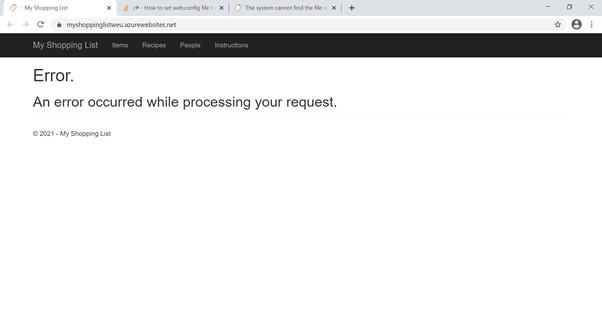 
**Figure 1 - Custom error message** 

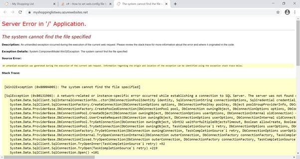 
**Figure 2 - Detailed error message** 
